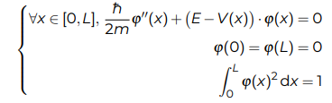
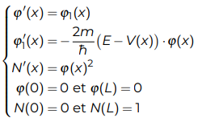
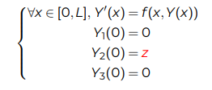
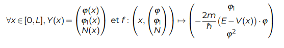
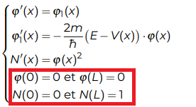
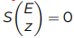
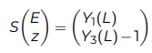

# Bureau d'étude explication

L'objectif est de résoudre l'équation de Schrödinger dans des configurations où c'est pas faisable à la main.
Qui revient à ça pour nous à ça :

puis ça:

 

En gros, c'est trouver les fonctions d'ondes pour les premiers niveaux d'énergie.

On peut séparer la résolution en 2 étapes :
* Résolution avec la méthode rkf45
* Résolution avec la méthode de Powell

 

## La méthode rkf45

Avec cette méthode on a besoin :
* de l'énergie
* du potentiel
* du __z__, la valeur initial de Y2 en 0

Pour résoudre cette équation :

avec :

En utilisant la librairie GSL suivante : [Ordinary Differential Equations](https://www.gnu.org/software/gsl/doc/html/ode-initval.html#ordinary-differential-equations) .

Pas besoin de tout lire faut juste récup l'[exemple](https://www.gnu.org/software/gsl/doc/html/ode-initval.html#examples) et le modifier pour corespondre à notre fonction et à la méthode rkf45, mais faut quand même lire pas mal pour comprendre.

### Le test

Une fois ça fait faut vérifié si cette partie marche en utilisant les données (E et z) trouvées dans la partie précédente du bureau d'étude, dans la partie du puit de potentiel.

__Attention__, la partie chiante ici c'est de modifié l'ordre de grandeur des valeurs (hbarre, l'énergie, la masse ,... ) en changeant leurs unités ( les secondes en femto-seconde) , pour avoir des constants sans exponentiel -30 par exemple.

Faut trouver:
* Y1(L)=0
* Y3(L)=1

parce que :

Maintenant que le test est fait et que l'on sait que ça marche.

Comment on fait si on a pas E et z ?

## La méthode de Powell

On les cherche avec la méthode de Powell (ou méthode hybride de Newton).

L'idée c'est de résoudre avec rfk45 et des valeurs (E et z) de départ quelconque puis de les modifié jusqu'à qu'on ait des valeurs de E et z qui donnent par rfk45 :
* Y1(L)=0
* Y3(L)=1

Ce qui revient à résoudre :

  avec  

Pour faire ça on utilise la librairie GSL suivante : [Multidimensional Root-Finding](https://www.gnu.org/software/gsl/doc/html/multiroots.html) , où l'on s'intéresse seulement à la partie ne nécessitant pas la dérivée.

Comme pour la méthode rkf45, on prend juste l'[exemple](https://www.gnu.org/software/gsl/doc/html/multiroots.html#examples) puis on le modifie.

### Le test

Pareil que pour la méthode rkf45, on test avec des les valeurs qu'on connait.

Ça doit faire qu'une itération avant de trouver les bonnes valeurs.

## La suite

Une fois que ça marche faut faire pour les configurations (Lucie va ou les a donnée jsp) où c'est pas faisable à la main.

Et on devra utilisé les résultats obtenus pour le truc à rendre à la fin.
